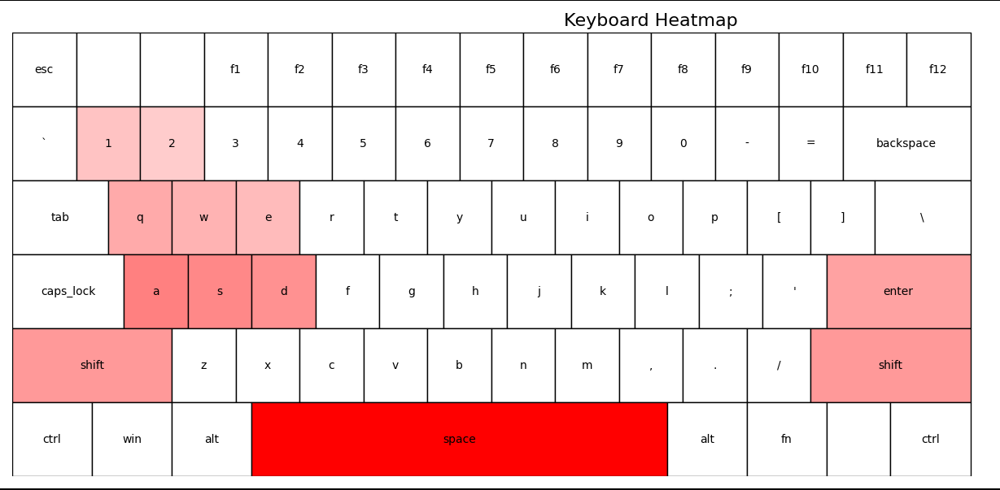

# ⌨️🖱️ Key & Mouse Activity Logger with Heatmaps​

Key & Mouse Activity Logger with Heatmaps is a lightweight, background-running tool that tracks your keyboard and mouse usage on Linux. It helps you understand your typing patterns, mouse habits, and hotkey frequency through rich visualizations like keyboard heatmaps and click charts. Whether you're a developer, gamer, writer, or just curious about your input behavior, this app turns your daily interactions into actionable insights and beautiful data-driven visuals.

-------
## 🌈 Visualization Example



-------
## 🚀 Features
✅ Background Keylogger    
_Logs every keypress in the background without interfering with your work._

✅ Mouse Click Tracking    
_Counts left, right, and middle mouse button clicks._

✅ Interactive Keyboard Heatmap    
_Visualize key usage with a dynamic heatmap from white 🔲 (least used) to red 🔴 (most used)._

✅ Custom Zones    
_Group keys into functional areas: Function keys, Letters, Numbers, Modifiers, etc._

✅ Usage Stats    
_Get total counts, top keys, and mouse click breakdowns._

✅ Modular & Configurable    
_Fully configurable via keyboard_layout.json for any keyboard layout (QWERTY, AZERTY, Dvorak…)._

✅ Export & Save    
_Save visualizations as .png_

-------
## 📦 Installation
Clone the repo:

bash
Copy
Edit
git clone https://github.com/yourusername/keymouse-logger.git
cd keymouse-logger
Install dependencies:

bash
Copy
Edit
pip install -r requirements.txt

-------
## 📂 Project Structure

📁 keymouse-logger/   
├── data       
     ├── keyboard_heatmap.png      # Sample heatmap output                       
├── layouts                            
     ├── keyboard_layout.json      # Keyboard layout, widths, and zones                                  
├── src                     
     ├── key_mouse_logger.py       # Main logger and visualizer                 
├── test                                 
├── requirements.txt                                                
└── README.md                                         

-------
## 🛠️ Usage
#### ▶️ Start Logging
Run in the background:

```
python3 key_mouse_logger.py --start
```

-------
#### 📊 Show Stats
Generate and Print stats from the logged data.
```
python3 key_mouse_logger.py --stats
```

```
--- Input Usage Statistics ---
Total Key Presses: 204
Total Mouse Clicks: 63
Mouse Click Breakdown:
  Left Clicks: 59
  Right Clicks: 4
  Middle Clicks: 0
Top 10 Pressed Keys:
  backspace: 21
  ctrl: 17
  t: 15
  space: 15
  e: 14
  enter: 10
  a: 9
  v: 8
  o: 8
  s: 8
Unique Keys Used: 35
```

-------
#### 🔥 Generate Heatmaps
Static Keyboard Heatmap (PNG):
```
python3 key_mouse_logger.py --heatmap
```

Mouse Click Bar Chart:
```
python3 key_mouse_logger.py --mousechart
```

-------
## 🔮 Possibilities
* ⌨️ Train your typing habits
* 🎮 Monitor gaming key zones
* ⏱️ Measure ergonomic effectiveness
* 📈 Visualize hotkeys used in productivity tools or IDEs
* 🧠 Discover your muscle memory patterns

-------
## 🧩 Customize Your Layout
* Edit keyboard_layout.json:
  * Rearrange keys
  * Resize wide keys (space, shift, enter)
  * Group keys into custom zones (e.g., Navigation, Coding, Gaming, Media)

-------
## 📌 Notes
🐧 Linux only (for now)
* Runs in user space, doesn’t require root
* Use nohup or a cronjob for persistent tracking

-------
## 📜 License
MIT License. Free to use, fork, and improve!

-------
## 🙌 Contributions Welcome!
Feel free to submit PRs or issues to add:
* More layouts (AZERTY, Dvorak, etc.)
* Timestamp logging
* CSV exports
* GUI for configuration


